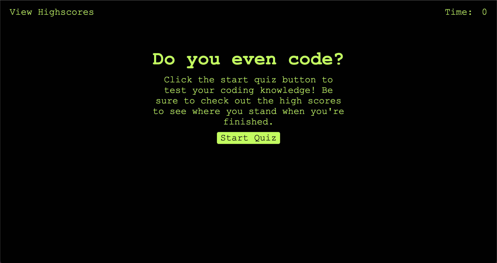

# Do You Even Code

## Description

My motivation for this app was to build something to test users knowledge on basic coding topics. Users can click the start button which will begin a quiz. This is a timed quiz and if you answer correctly you will get more time, if you answer incorrectly time will be taken away. After the quiz is done users will be brought to the high scores page.

## Usage

Open in default browser and click start quiz button to start!

## Contributing

If you would like to contribute please fork the repo and submit a pull request.

## Questions

If you have any questions please reach out via Github, my username is jessemarino.

URL: https://jessemarino.github.io/do-you-even-code/
