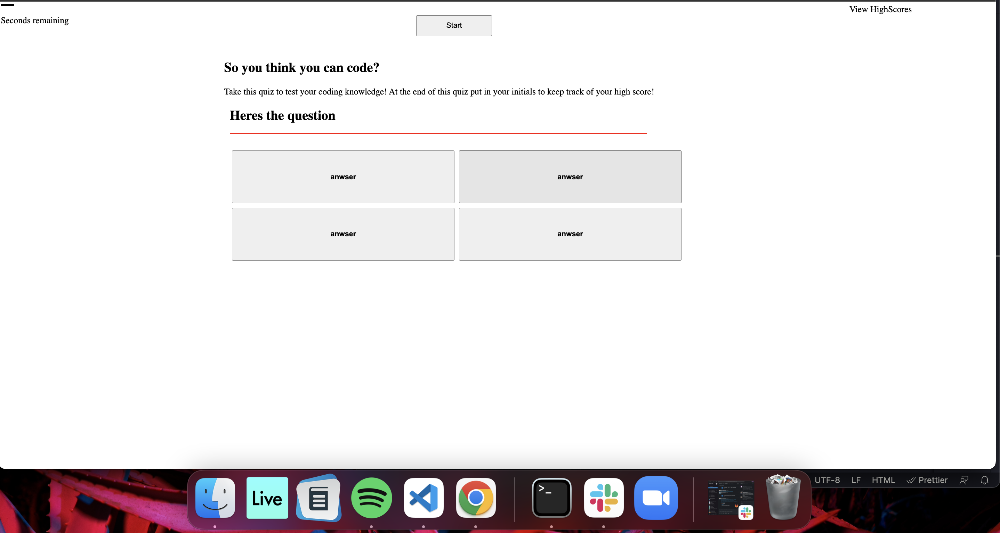

# do-you-even-code

My motivation to build "do you even code" was to create a test for new coders. I wanted to test my skills at creating a quiz/test game that would challange me and other new developers. "Do you even code" solves the problem of you wondering if you can code or not, it solved mine. I learned that I need to futher research /learn Javascript, but I also learned how to use inner.html. Please note this project isn't finished.

URL: https://jessemarino.github.io/do-you-even-code/
